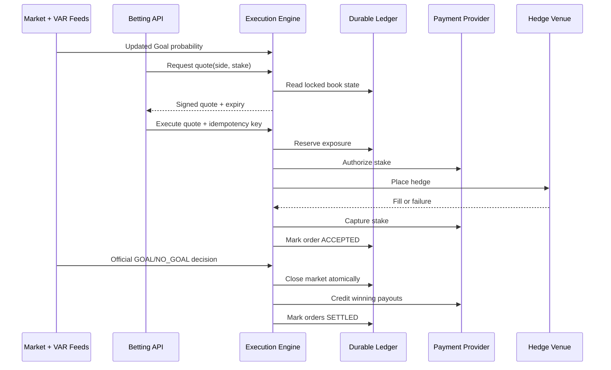

# VAR Bet Order Execution Engine

This package is a standalone order-execution scaffold. It is separate from the Monte Carlo simulation.

It handles:

- dynamic Goal/No-Goal quotes;
- quote locking and tamper-resistant signatures;
- hard worst-case exposure checks;
- duplicate-request protection;
- stake authorization and capture;
- hedge-fill requirements;
- immediate market closure;
- idempotent settlement and payout.

The included adapters are in-memory demonstrations. Replace them before processing real money.

## Files

| File                  | Purpose                                                                      |
| --------------------- | ---------------------------------------------------------------------------- |
| `engine.ts`           | Core pricing, risk, order state machine, settlement, and provider interfaces |
| `run-demo.ts`         | Runs a complete local example without external payments or trades            |
| `config.example.json` | Commercial and risk-control inputs                                           |
| `package.json`        | Workspace scripts and TypeScript dependencies                                |
| `tsconfig.json`       | Strict TypeScript configuration                                              |

## Run the demo

```bash
pnpm install
pnpm --filter @var-bets/execution-engine demo
```

The demo creates three quotes, executes accepted orders, closes the market with `NO_GOAL`, pays the winning order, and prints the final book exposure.

## Runtime sequence



## Inputs

### Configuration inputs

| Variable                | Meaning                                            | Current example |
| ----------------------- | -------------------------------------------------- | --------------: |
| `base_overround`        | Base house margin added to implied probabilities   |          `0.07` |
| `inventory_sensitivity` | How strongly odds respond to payout imbalance      |          `0.08` |
| `minimum_decimal_odds`  | Reject instead of offering odds below this value   |          `1.05` |
| `maximum_decimal_odds`  | Maximum payout multiple displayed                  |          `20.0` |
| `minimum_stake`         | Smallest accepted stake                            |            `$1` |
| `maximum_stake`         | Largest stake before dynamic risk checks           |          `$500` |
| `maximum_unhedged_loss` | Hard book loss limit before hedge payoff           |        `$1,000` |
| `quote_ttl_ms`          | Time during which displayed odds remain executable |        `500 ms` |
| `require_hedge_fill`    | Reject and refund when the hedge does not fill     |          `true` |

`maximum_unhedged_loss` is a loss cap, not a guaranteed profit. Set it to zero only when the hedge model and execution guarantees support that constraint. Early one-sided bets cannot offer decimal odds above `1.00` while simultaneously guaranteeing profit without outside liquidity or a hedge.

### Quote request inputs

The application sends:

- `market_id`;
- `user_id`;
- `side`: `GOAL` or `NO_GOAL`;
- `stake`.

The engine adds:

- current Goal probability;
- current book liabilities;
- dynamic decimal odds;
- maximum safe odds;
- locked potential payout;
- quote expiry;
- HMAC quote signature.

All money fields inside the TypeScript engine use integer cents. Decimal odds and probabilities remain numbers, but stake, payout, liability, hedge payoff, and execution cost never use floating-point dollars.

### Market snapshot inputs

`MarketSnapshot` requires:

| Field               | Source                                                    |
| ------------------- | --------------------------------------------------------- |
| `goal_probability`  | Your signal service, not the raw match-winner probability |
| `source_version`    | Unique market-feed sequence number or timestamp           |
| `observed_at`       | Timestamp from the pricing feed                           |
| `betting_closes_at` | VAR market deadline maintained by the event service       |
| `is_open`           | Event-service market state                                |

## Required data sources

### 1. Match-market data

Use Polymarket’s public market APIs for discovery and prices:

- Gamma API for event, market, outcome, and token discovery;
- CLOB WebSocket market channel for live order-book and price updates;
- CLOB historical-price endpoint for backtesting only.

Do not pass Argentina’s win probability directly into `goal_probability`. A separate signal service must transform match-price changes into a calibrated probability that the reviewed goal will stand.

The live signal service should publish a new `MarketSnapshot` whenever any of these change:

- Polymarket midpoint or executable price;
- order-book depth;
- referee/VAR state;
- hedge liquidity;
- feed latency or staleness.

### 2. Official event feed

The event service needs three low-latency events:

- `BALL_IN_NET`: open the temporary market;
- `VAR_REVIEW` or `MONITOR`: update the signal state;
- `FINAL_DECISION`: atomically stop quotes and settle.

Use a licensed sports-data source or another authoritative event feed. A television stream should not be the settlement authority.

### 3. User and wallet data

Before creating a quote, the application should supply:

- verified user identity;
- jurisdiction and responsible-gaming eligibility;
- available wallet balance or payment capacity;
- per-user and per-event limits;
- fraud and device-risk decision.

### 4. Hedge execution data

The hedge adapter needs:

- target prediction-market token;
- side and size;
- current depth and estimated slippage;
- maximum acceptable price;
- fill-or-kill or immediate-or-cancel policy;
- venue order ID and actual fill details.

## Calculations

### 1. Dynamic probability and margin

The engine receives `p_goal` from the signal service and constructs implied quote probabilities:

```text
imbalance = clamp((payout_if_goal - payout_if_no_goal) / loss_limit, -1, 1)

q_goal    = p_goal × (1 + overround) + inventory_sensitivity × imbalance
q_no_goal = (1 - p_goal) × (1 + overround) - inventory_sensitivity × imbalance

decimal_odds = 1 / selected_q
```

More Goal exposure therefore lowers Goal payouts and improves No-Goal pricing. The reverse occurs when No-Goal exposure dominates.

Implementation: `BetExecutionEngine.inventoryAdjustedOdds()`.

### 2. Hard risk cap

Soft odds movement is followed by a hard payout constraint:

```text
maximum_safe_payout =
    projected_handle
    + hedge_payoff_for_selected_result
    - reserved_execution_cost
    + maximum_unhedged_loss

maximum_safe_odds =
    (maximum_safe_payout - existing_selected_result_payout) / stake

offered_odds = min(market_odds, maximum_safe_odds, maximum_decimal_odds)
```

If `offered_odds < minimum_decimal_odds`, the engine rejects the quote.

Implementation: `BetExecutionEngine.riskCappedOdds()`.

### 3. Worst-case book result

```text
profit_if_goal =
    accepted_handle
    - payout_if_goal
    + hedge_payoff_if_goal
    - reserved_execution_cost

profit_if_no_goal =
    accepted_handle
    - payout_if_no_goal
    + hedge_payoff_if_no_goal
    - reserved_execution_cost

worst_case_profit = min(profit_if_goal, profit_if_no_goal)
```

The order is rechecked against this constraint at execution time because other users may have changed the book after the quote was displayed.

### 4. Locked payout

Once accepted:

```text
potential_payout = stake × locked_decimal_odds
```

Future price changes do not alter that order’s payout.

### 5. Settlement

```text
winning payout = potential_payout
losing payout  = 0
```

The original stake is included in decimal-odds payout.

## Engine sections

| Function or class                   | Responsibility                                                 |
| ----------------------------------- | -------------------------------------------------------------- |
| `BetExecutionEngine.createQuote()`  | Validate request, read book, calculate and sign dynamic quote  |
| `BetExecutionEngine.executeQuote()` | Idempotency, expiry, risk reservation, payment, hedge, capture |
| `BetExecutionEngine.settleMarket()` | Close once, determine winners, issue idempotent payouts        |
| `BookState`                         | Handle, liabilities, hedge payoff, and worst-case result       |
| `PaymentPort`                       | Payment-provider boundary                                      |
| `HedgePort`                         | Polymarket/Kalshi execution boundary                           |
| `LedgerPort`                        | Durable transactional storage boundary                         |
| `MarketDataPort`                    | Current calibrated Goal probability and market status          |

## Where to wire payments

Implement `PaymentPort` in `engine.ts` using your wallet or payment provider.

### `authorize()`

Called after exposure is reserved but before hedging. It must place a hold on the user’s stake without double-charging retries.

Map to:

- card authorization;
- wallet-balance reservation;
- internal cash-ledger hold.

### `capture()`

Called only after the required hedge succeeds. It converts the hold into a completed stake debit.

### `void()`

Called when the hedge fails or another execution stage fails. It releases the payment hold.

### `creditPayout()`

Called during settlement for winning orders. The idempotency key is based on settlement event and order ID, preventing duplicate payouts.

Do not call blockchain or banking APIs directly from controller routes. Put provider SDK calls inside a `PaymentPort` implementation and write every request and response to the payment ledger.

## Where to wire hedging

Implement `HedgePort.execute()` using the authenticated trading client for the selected venue.

It must return:

- venue hedge-order ID;
- whether the required quantity filled;
- payoff contribution under Goal;
- payoff contribution under No Goal;
- reserved fees and slippage.

When `require_hedge_fill=true`, an incomplete hedge causes the user order to be rejected and the payment authorization to be voided.

`HedgePort.unwind()` is called if the hedge filled but payment capture subsequently failed.

Because a match-winner contract is only a proxy for a VAR decision, hedge payoffs must be estimated and reconciled using actual filled positions. Do not assume a one-to-one hedge ratio.

## Durable storage

Replace `InMemoryLedger` with a transactional database implementation. At minimum, create:

- `markets`;
- `market_book_state`;
- `quotes`;
- `bet_orders`;
- `payment_transactions`;
- `hedge_orders`;
- `settlement_events`;
- `outbox_events`.

Use row-level locking or atomic compare-and-swap on `market_book_state`. Never hold a database transaction open while waiting for a remote payment or exchange API. In production, reserve exposure transactionally, commit, then execute remote actions using an outbox/saga workflow.

## Suggested API endpoints

```text
POST /v1/markets/{market_id}/quotes
POST /v1/orders
GET  /v1/orders/{order_id}
POST /internal/v1/markets/{market_id}/close
POST /internal/v1/markets/{market_id}/settle
```

Every mutating request must require an idempotency key.

## Production changes required

Before real-money use, replace:

- `MutableMarketData` with the live signal service;
- `InMemoryLedger` with a transactional database;
- `InMemoryPayments` with a licensed payment/wallet provider;
- `NoopHedge` with authenticated exchange execution;
- the demo signing secret with a secret-manager value.

Also add authentication, KYC/AML, jurisdiction controls, responsible-gaming limits, audit logging, observability, provider reconciliation, disaster recovery, and legal review for every operating jurisdiction.
